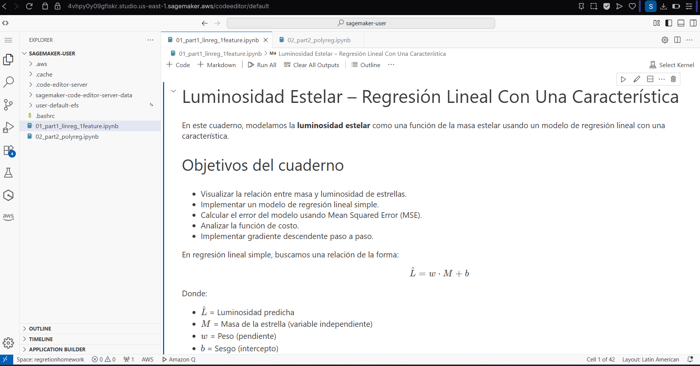
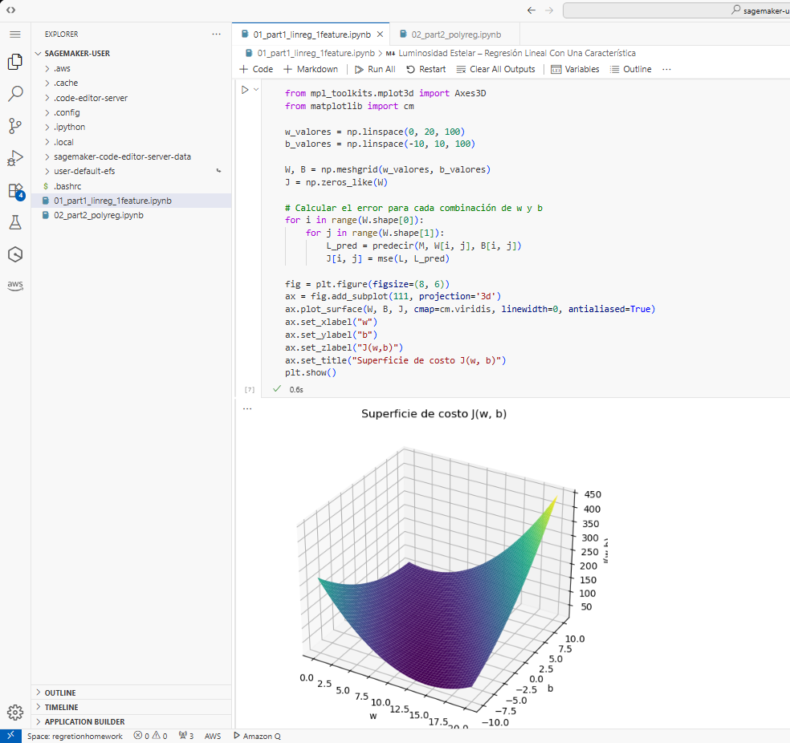
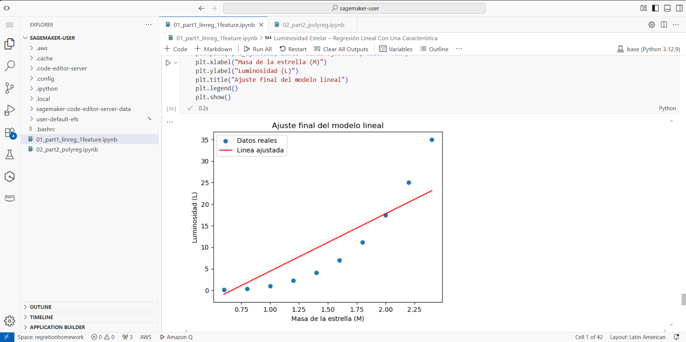
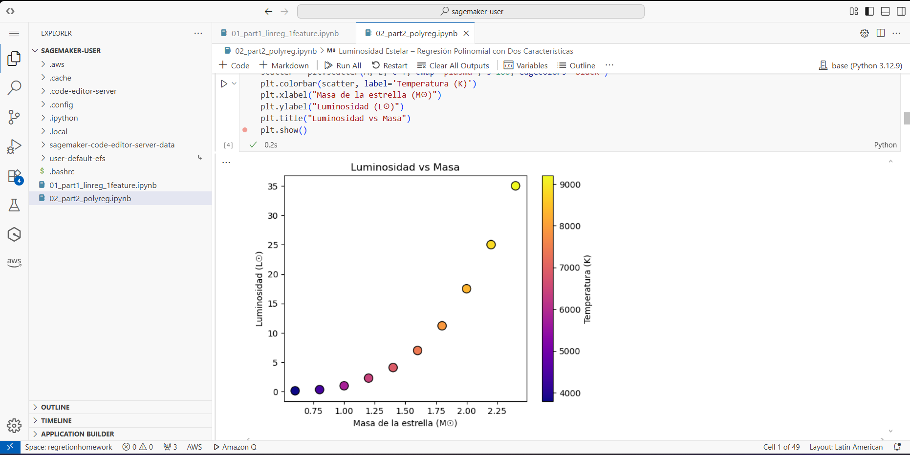
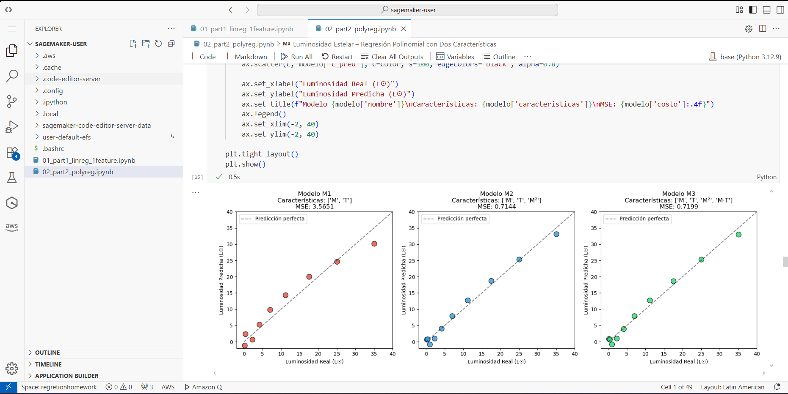

# Luminosidad Estelar - Modelos de Regresión Lineal y Polinomial

Este repositorio contiene la implementación desde cero de modelos de **regresión lineal** y **regresión polinomial** aplicados al problema de predicción de luminosidad estelar, desarrollado como parte del curso de **Transformación Digital y Arquitectura Empresarial (TDSE)**.

## Autor

- Juan Sebastian Ortega Muñoz

## Descripción del Laboratorio

En astronomía, existe una relación física entre la masa de una estrella y su luminosidad. Las estrellas más masivas tienden a ser más luminosas, pero esta relación no es lineal; la luminosidad crece mucho más rápido que la masa.

---

## Fundamentos Teóricos

### ¿Qué es la Regresión?

La regresión es una técnica de aprendizaje supervisado que busca encontrar una función que relacione variables de entrada (características) con una variable de salida (objetivo). En nuestro caso:

- **Entrada**: Masa ($M$) y Temperatura ($T$) de una estrella
- **Salida**: Luminosidad ($L$) de la estrella

### Regresión Lineal Simple

En la regresión lineal, asumimos que la relación entre las variables es una línea recta:

$$\hat{L} = w \cdot M + b$$

Donde:
- $\hat{L}$ = Luminosidad predicha
- $w$ = Peso (pendiente de la recta)
- $b$ = Sesgo (intercepto con el eje Y)
- $M$ = Masa de la estrella

### Regresión Polinomial

Cuando la relación no es lineal (como en nuestro caso), podemos crear características polinomiales:

$$\hat{L} = w_1 \cdot M + w_2 \cdot T + w_3 \cdot M^2 + w_4 \cdot (M \cdot T) + b$$

El término $M^2$ captura el crecimiento acelerado, y $M \cdot T$ captura la interacción entre masa y temperatura.

### Función de Costo (MSE)

Para medir qué tan buenas son nuestras predicciones, usamos el Error Cuadrático Medio:

$$J(w, b) = \frac{1}{2m} \sum_{i=1}^{m} (\hat{L}^{(i)} - L^{(i)})^2$$

- Si $J$ es grande → las predicciones son malas
- Si $J$ es pequeño → las predicciones son buenas

### Gradiente Descendente

Es el algoritmo de optimización que usamos para encontrar los mejores valores de $w$ y $b$. Funciona así:

1. Empezamos con valores aleatorios de $w$ y $b$
2. Calculamos qué tan equivocados estamos (el costo)
3. Calculamos en qué dirección debemos movernos (gradientes)
4. Damos un pequeño paso en esa dirección
5. Repetimos hasta converger

Las reglas de actualización son:

$$w := w - \alpha \cdot \frac{\partial J}{\partial w}$$

$$b := b - \alpha \cdot \frac{\partial J}{\partial b}$$

Donde $\alpha$ es la tasa de aprendizaje (qué tan grande es cada paso).

---

## Notebooks

### Notebook 1: Regresión Lineal con Una Característica

**Archivo**: `01_part1_linreg_1feature.ipynb`

En este notebook implementamos regresión lineal simple usando solo la masa ($M$) para predecir la luminosidad ($L$).

#### ¿Qué se hizo?

1. **Visualización de datos**: Graficamos masa vs luminosidad para entender la relación
2. **Implementación del modelo**: Creamos la función de predicción $\hat{L} = w \cdot M + b$
3. **Función de costo**: Implementamos MSE para medir el error
4. **Gradiente descendente**: Implementamos el algoritmo de optimización (versión no vectorizada y vectorizada)
5. **Experimentos**: Probamos diferentes tasas de aprendizaje
6. **Ajuste**: Graficamos la línea ajustada vs los datos reales

#### ¿Qué se aprendió?

- El modelo lineal captura la tendencia general pero no es suficiente para este problema
- La luminosidad crece más rápido que linealmente con la masa
- El gradiente descendente converge correctamente con una tasa de aprendizaje adecuada
- Elegir bien $\alpha$ es crucial: muy pequeño = lento, muy grande = inestable

---

### Notebook 2: Regresión Polinomial con Dos Características

**Archivo**: `02_part2_polyreg.ipynb`

En este notebook mejoramos el modelo agregando la temperatura ($T$) y características polinomiales.

#### ¿Qué se hizo?

1. **Ingeniería de características**: Creamos nuevas variables $[M, T, M^2, M \cdot T]$
2. **Normalización**: Escalamos las características para que el gradiente descendente funcione mejor
3. **Implementación vectorizada**: Usamos operaciones matriciales para mayor eficiencia
4. **Comparación de modelos**: Evaluamos 3 modelos con diferentes características:
   - M1: Solo $[M, T]$
   - M2: $[M, T, M^2]$
   - M3: $[M, T, M^2, M \cdot T]$ (completo)
5. **Análisis de interacción**: Estudiamos la importancia del término $M \cdot T$
6. **Inferencia**: Predijimos la luminosidad de una estrella nueva

#### ¿Qué se aprendió?

- Agregar características polinomiales mejora significativamente el modelo
- El término $M^2$ captura el crecimiento acelerado de la luminosidad
- El término de interacción $M \cdot T$ es importante porque el efecto de la masa depende de la temperatura
- La normalización es esencial cuando las características tienen escalas muy diferentes
- El modelo M3 (completo) logra el menor error

---

## Evidencia de ejecución de AWS SageMaker

### Carga de los notebooks en AWS SageMaker

Los dos notebooks de Jupyter fueron cargados directamente en AWS SageMaker Studio utilizando la opción de carga de archivos del explorador de archivos de SageMaker.

Una vez dentro del editor de codigo de SageMaker Studio, los archivos .ipynb se subieron al directorio de trabajo (/home/sagemaker-user/) y se abrieron usando el kernel por defecto de Python 3.
No fue necesario realizar configuraciones adicionales ni procesos de despliegue.

### Evidencia de ejecución

Los siguientes pantallazos muestran la evidencia de una ejecución exitosa en AWS SageMaker:

#### Notebooks cargados

#### Notebook 1: Regresión Lineal con Una Característica

#### Notebook 2: Regresión Polinomial con Dos Características

### Comparación entre ejecución local y ejecución en AWS SageMaker

Los notebooks fueron ejecutados tanto de forma local como en AWS SageMaker y no se observaron diferencias significativas entre la ejecución local y la ejecución en SageMaker en cuanto a resultados, salidas o comportamiento del modelo.

AWS SageMaker ofrece un entorno estable y preconfigurado donde librerías comunes de ciencia de datos como NumPy, Pandas, Matplotlib ya están disponibles, lo que permitió ejecutar los notebooks sin configuraciones adicionales.
En general, la ejecución en SageMaker fue consistente con la ejecución local, confirmando que los notebooks son reproducibles y portables en un entorno en la nube.

